# Enhance product service

- Delete product rpc call

- Wire into smoketest.sh

- Wire into perf-test

- Wire unit-test for this method

# Enhance order service

- List orders rpc call

- Wire into smoketest.sh

- Wire into perf-test

- Wire unit-test for this method

# Execute performance test

- **Question 1**: Why is performance degrading as the test run longer?

- A: Because when we are getting the list of products, for every key we are connecting to database and getting all fields this causes the degrading.

- **Question 2**: How do you fix it?

- A: or the validation about existing products just we need the ids, we don't need to access to all fields so just I'm accessing to the product ids. Other better solution can be caching this data but this only works if products don't change all the time.

- **Fix it**

**Test of everything is running correctly:**
**Services Running:**

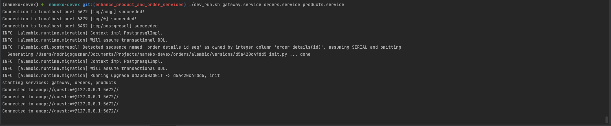
**Logs of Unit Test:**
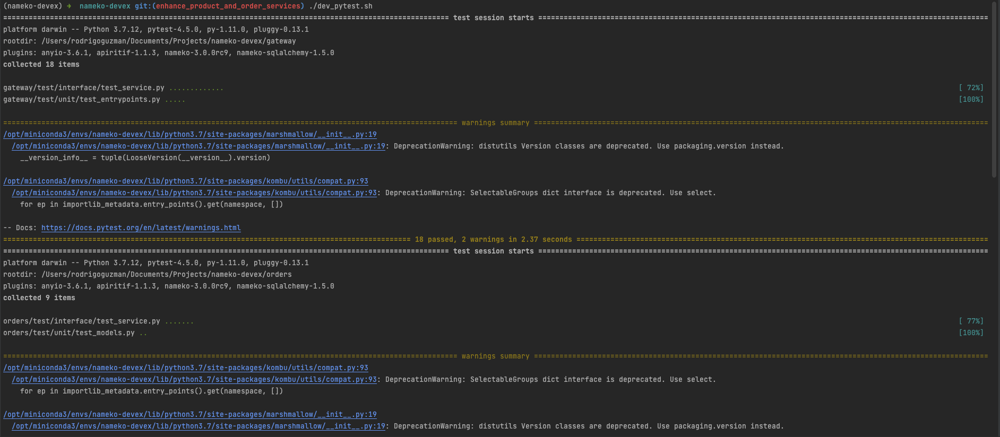
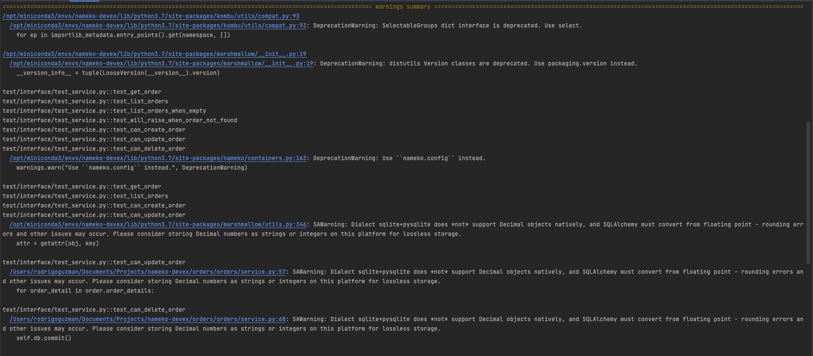
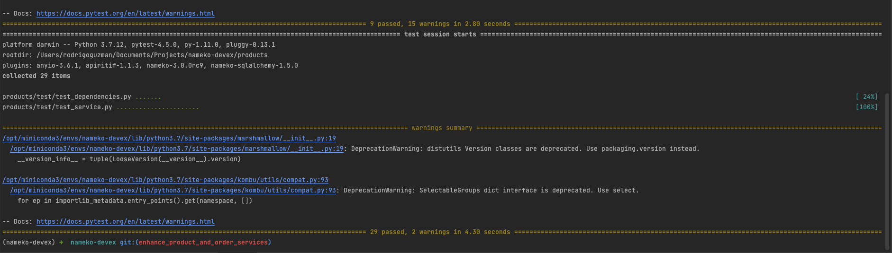

**Logs of Smoketests:**
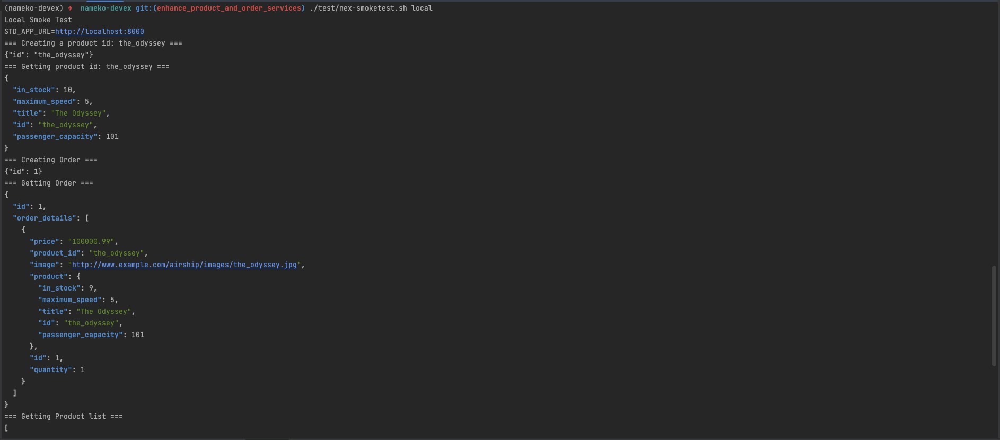
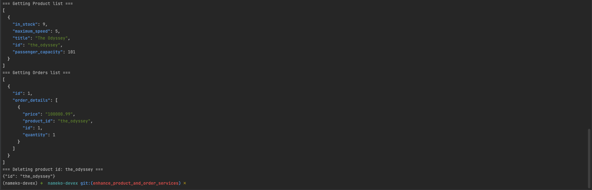

**Logs of bzt performance tests:**
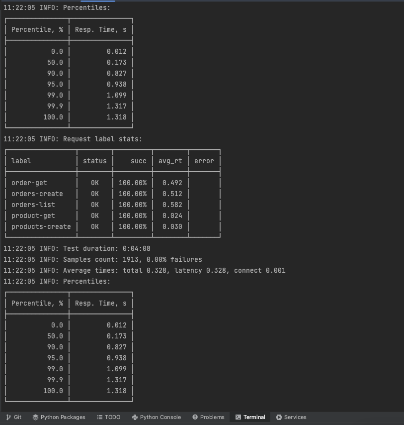
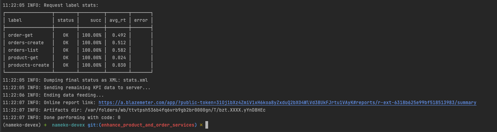

**Reports on BlazeMeter:**
**Summary**
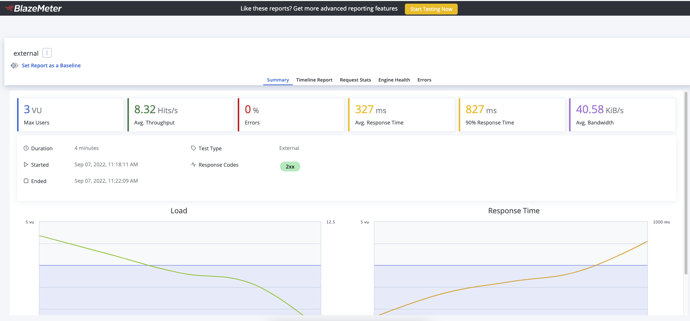

**Timeline Report with orders-create:**
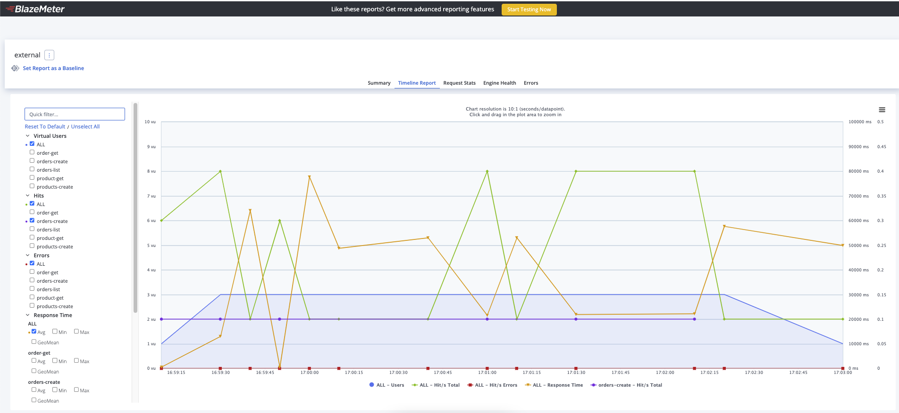

**Requests Stats:**
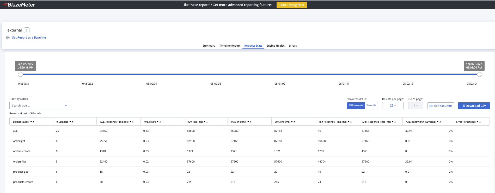

**Engine Health:**
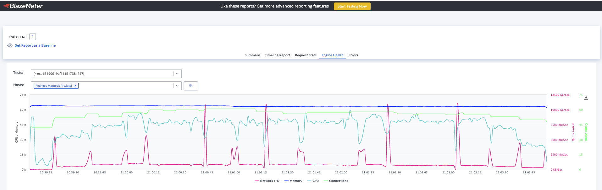

**Errors:**
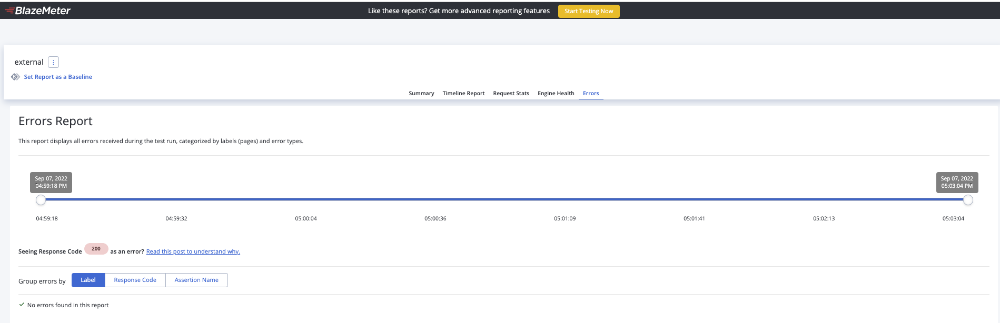

